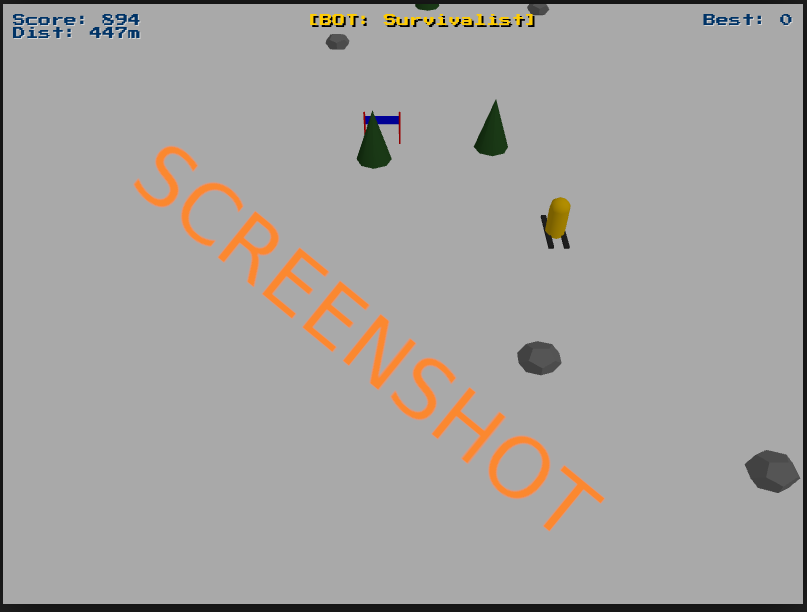

# js_laskettelu_redux


# SKI-3D (JavaScript / Three.js)

SKI-3D is a retro-styled 3D downhill skiing game built with
**JavaScript** and **Three.js**.\
The game focuses on fast arcade gameplay, simple controls, and
experimental AI "autobot" modes.

------------------------------------------------------------------------

## Screenshots


## Features

-   ⛷️ **3D Downhill Skiing Gameplay**
-   🌲 Procedurally spawned obstacles (trees, rocks, moguls, gates)
-   🤖 **Autobot (AI) modes** with multiple algorithms
-   👹 **Yeti enemy** that appears after long runs
-   🎮 Keyboard controls
-   🧠 Local high score & leaderboard (LocalStorage)
-   🎨 Customizable skier style
-   🕹️ Retro UI using *Press Start 2P* font

------------------------------------------------------------------------

## Controls

### Player Controls

-   **← / →** -- Steer left / right\
-   **↓** -- Brake / straighten skis

### Modes

-   **B** -- Toggle Autobot (AI plays for you)
-   **1--4** -- Switch AI algorithm (when Autobot is enabled)
-   **D** -- Toggle Developer Mode (debug)

------------------------------------------------------------------------

## Gameplay Mechanics

-   **Trees & Rocks** → Crash (Game Over)
-   **Moguls** → Jump + bonus points
-   **Gates** → Bonus points if passed correctly
-   **Yeti** → Chases the player after long distance

Jumping allows you to avoid some obstacles.

------------------------------------------------------------------------

## AI (Autobot) Algorithms

Currently implemented bots include:

1.  **Survivalist**
    -   Prioritizes avoiding crashes
    -   Uses lane-based obstacle detection
2.  **Greedy**
    -   Actively seeks gates and moguls
    -   Avoids immediate threats

You can switch bots during gameplay using number keys.

------------------------------------------------------------------------

## Technical Details

-   **Rendering:** Three.js (WebGL)
-   **Camera:** Perspective camera with downhill angle
-   **Fog:** Long-distance fog for depth without early fade
-   **Storage:** LocalStorage for:
    -   High score
    -   Leaderboard
    -   Selected skier style

------------------------------------------------------------------------

## File Requirements

You must provide Three.js locally:

    three.core.min.js

This should be a renamed copy of:

    three.module.min.js

If `WebGLRenderer` is missing, the game will not start.

------------------------------------------------------------------------

## Running the Game

Because ES modules are used, you must run the game via a local server.

### Example (Python):

``` bash
python3 -m http.server
```

Then open:

    http://localhost:8000

------------------------------------------------------------------------

## Customization

-   Skier styles are selectable from the main menu
-   Selection is saved automatically
-   New obstacle types and bots can be added easily in code

------------------------------------------------------------------------

## Known Limitations

-   No mobile/touch controls
-   Fixed resolution (800×600)
-   Local-only leaderboard

------------------------------------------------------------------------

## License

This project is provided for **learning and experimentation**.\
You are free to modify and extend it.

------------------------------------------------------------------------

Enjoy skiing! 🎿
